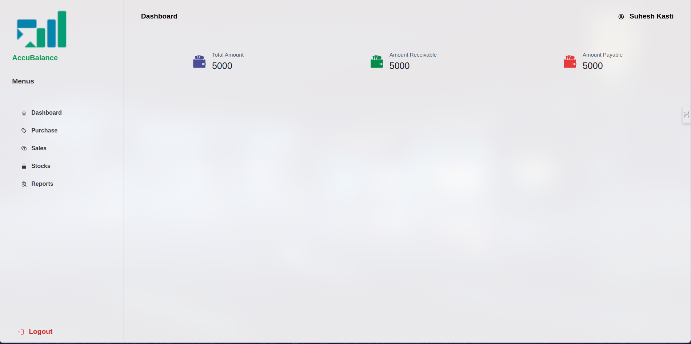

 # AccuBalance: Your Simple Yet Intuitive Accounting Solution

**Overview**

AccuBalance is a user-friendly accounting application designed to streamline financial management for small and medium-sized businesses. With its intuitive interface and powerful features, AccuBalance simplifies the process of recording purchases, sales, and generating insightful reports.

**Features**

- **Transaction Management**: Easily add and manage purchases and sales transactions.
- **Smart Recommendations**: Receive recommendations on popular and unpopular items to optimize stock inventory.
- **Comprehensive Reports**: Access detailed reports on sales, purchases, tax payments, and more.
- **Security Testing**: Ensures the application's security through rigorous testing.
- **Docker Support**: Effortlessly install AccuBalance using Docker for quick and easy deployment.

**Getting Started**

1. **Installation**: To install AccuBalance using Docker, simply run the following command:
```bash
 curl https://raw.githubusercontent.com/Suhesh-Kasti/AccuBalance/main/docker-compose.yaml -o docker-compose.yaml

 docker-compose up -d
```

**From github source**: For development you might want to clone the repo and start working from there:
```bash
 git clone git@github.com:sazan991/AccuBalance.git
 cd AccuBalance
```
After development you can ximply run the following docker command to start the backend and frontend:
```bash
 docker-compose -f accubalance.yaml up
```

2. **Usage**:
   - Access AccuBalance by navigating to http://localhost:3000 in your web browser.
   - Log in with your credentials or create a new account if you're a new user.
   - Start recording your purchases and sales transactions to manage your finances effectively.

**Screenshots**



**Contributing**

> We welcome contributions from the community to improve AccuBalance. If you find any issues or have ideas for enhancements, feel free to submit a pull request or open an issue on GitHub.

**License**

This project is licensed under the [MIT License](LICENSE). Feel free to modify and distribute the application according to the terms of the license.

---

